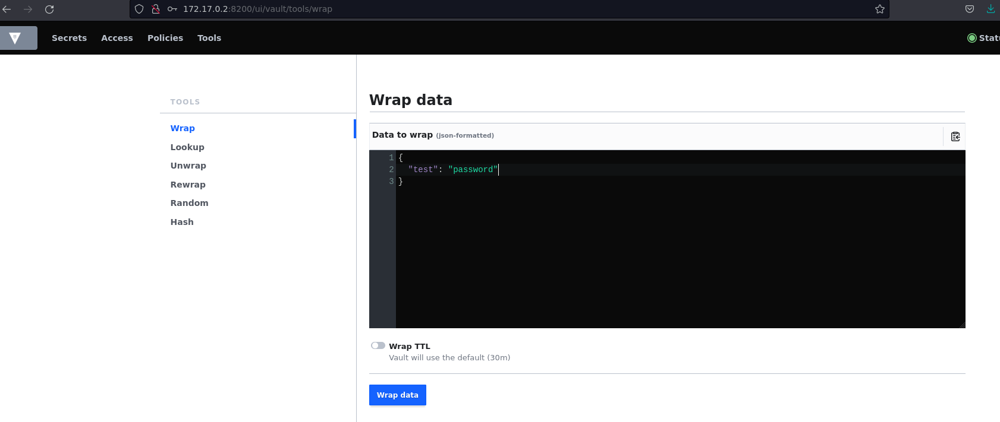
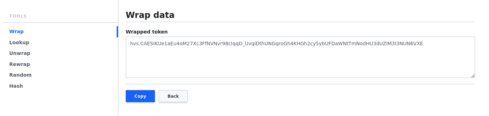
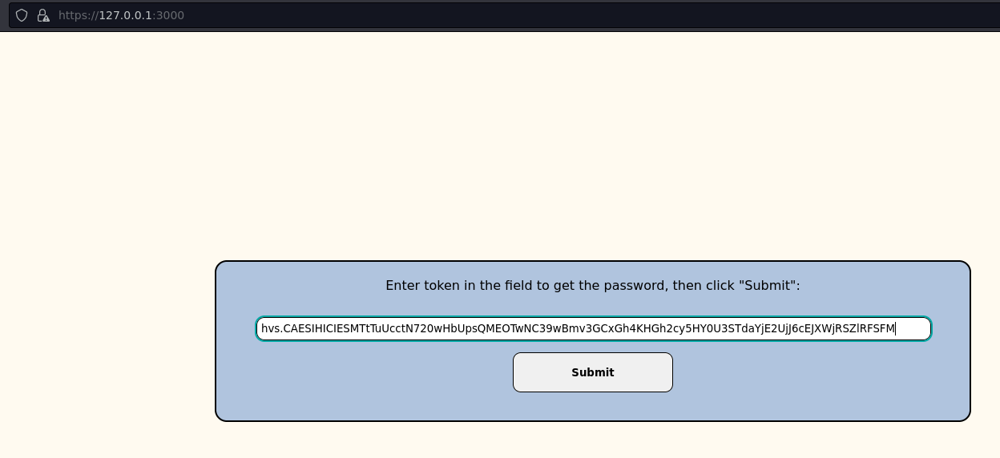

# Only Docker 
> run commands in this order because of docker's IP address
```
docker pull lanboy/unwrap-webapp
docker run -d -p 3000:3000 lanboy/unwrap-webapp
docker run -d --cap-add=IPC_LOCK -e 'VAULT_DEV_ROOT_TOKEN_ID=myroot' -e 'VAULT_DEV_LISTEN_ADDRESS=0.0.0.0:8200' vault
```

# Downloading everything
## Download
```
git clone https://github.com/McLan/secrets-unwrapping-webapp.git
cd Hashicorp-Vault-secrets-unwrapping-webapp
```

## Installation
```
npm install
```

## Generate certificates
```
cd certs
chmod +x certgen.sh
./certgen.sh <hostname>
cd ..
```

## Run vault in container
```
docker run -d --cap-add=IPC_LOCK -e 'VAULT_DEV_ROOT_TOKEN_ID=myroot' -e 'VAULT_DEV_LISTEN_ADDRESS=0.0.0.0:8200' vault
```
## change vault's IP address in servers.js
```
sed "s/172.17.0.3/172.17.0.2/g" server.js
```

## Wrap data 
### Via vault via API 
```
curl -v -k --header "X-VAULT-TOKEN: myroot" -X POST --header "X-Vault-Wrap-TTL: 60m" --data '{"test":"password"}' http://172.17.0.2:8200/v1/sys/wrapping/wrap
```

### Via Vault UI
1. Browse on http://172.17.0.2:8200/
2. Authenticate with the following token : myroot
3. In tab *Tools > Wrap*, write data you want to wrap in JSON format and click *Wrap data*
4. Copy your token



## Run node app 
```
node server.js
```

## Browse on one of this urls and enter your token
* https://127.0.0.1:3000
* https://hostname:3000
* https://IP:3000




## With HTTPS
To implement communication via HTTPS from the web app to vault, uncomment the 3 ligns at the beginning of server.js, and add the root CA's certificate (or the full chain of CA's certificates, intermerdiary and root) in the /certs/ folder.
```
//require('ssl-root-cas/latest')
//    .inject()
//    .addFile(__dirname + '/certs/fullCACertchain.crt');
```

# HTTPS with docker
1. Clone the repository 
2. Run npm install inside the folder
3. Generate certificates with certgen.sh
4. Modify server.js (as in "With HTTPS" section above)
5. add the certificate chain in the /cert/ folder
6. Create a new docker image and run it with :
```
docker build . -t <username>/unwrap-webapp
docker run -d -p 3000:3000 <username>/unwrap-webapp
```