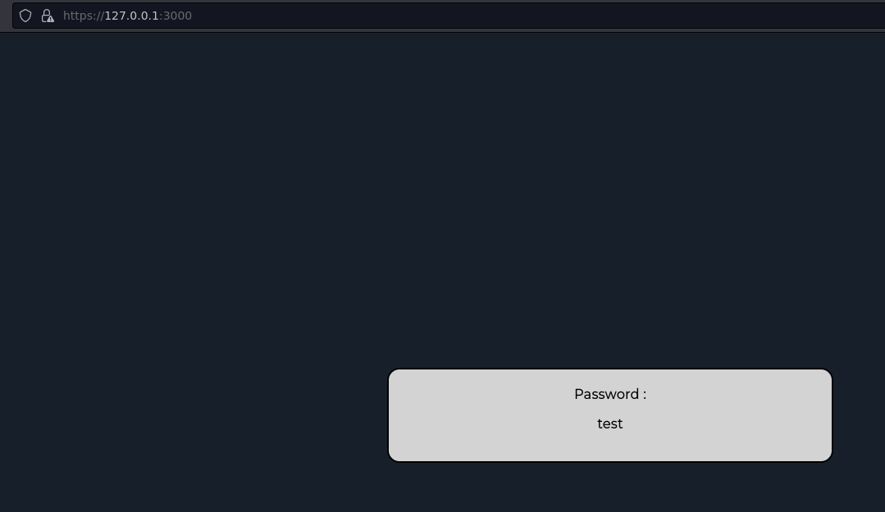

# Only Docker 
> run commands in this order because of docker's IP address
```
docker pull lanboy/unwrap-webapp
docker run -d lanboy/unwrap-webapp
docker run -d --cap-add=IPC_LOCK -e 'VAULT_DEV_ROOT_TOKEN_ID=myroot' -e 'VAULT_DEV_LISTEN_ADDRESS=0.0.0.0:8200' vault
```

# Downloading everything
## Download
```
git clone https://github.com/McLan/secrets-unwrapping-webapp.git
cd Hashicorp-Vault-secrets-unwrapping-webapp
```

## Installation
```
npm install
```

## Generate certificates
```
cd certs
chmod +x certgen.sh
./certgen.sh <hostname>
cd ..
```

## Run vault in container
```
docker run --cap-add=IPC_LOCK -e 'VAULT_DEV_ROOT_TOKEN_ID=myroot' -e 'VAULT_DEV_LISTEN_ADDRESS=0.0.0.0:8200' vault

```
## Open another terminal and change vault's IP address in servers.js inside the container
```
sed "s/172.17.0.3/172.17.0.2/g" server.js
```

## Wrap data with vault via API (or via UI at http://172.17.0.2:8200/ui/vault/tools/wrap)
```
curl -v -k --header "X-VAULT-TOKEN: myroot" -X POST --header "X-Vault-Wrap-TTL: 60m" --data '{"test":"password"}' http://172.17.0.2:8200/v1/sys/wrapping/wrap
```

## Run node app 
```
node server.js
```

## Browse on one of this urls and enter your token
* https://127.0.0.1:3000
* https://hostname:3000
* https://IP:3000


